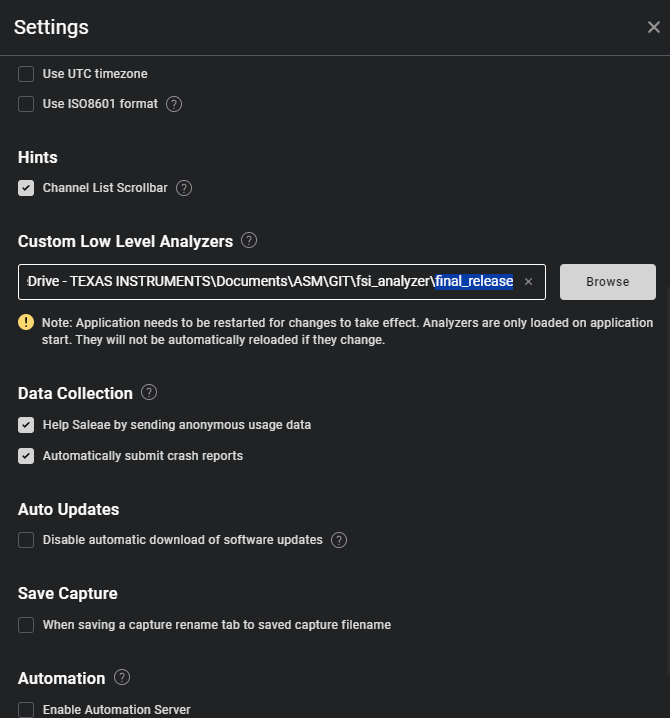
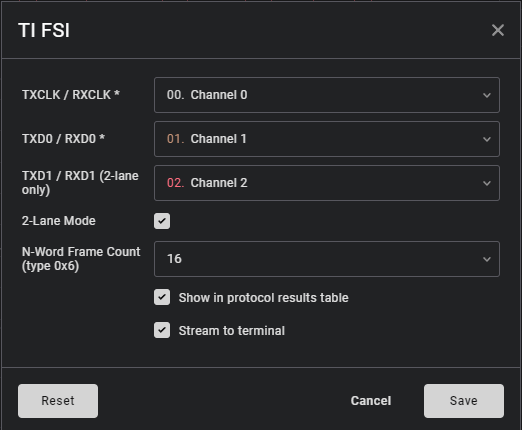
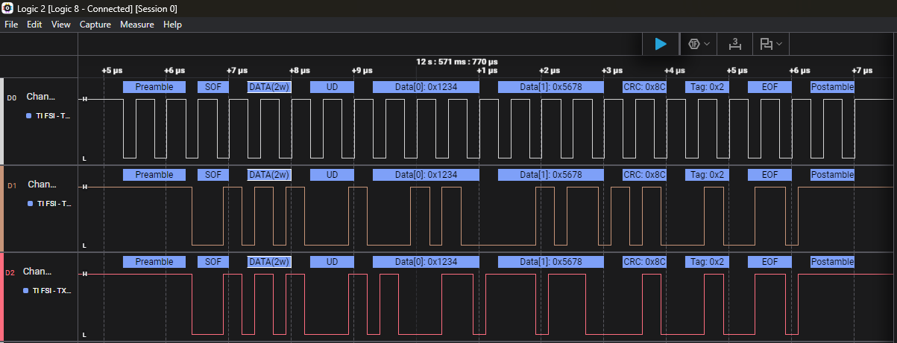

# TI FSI Saleae Logic Analyzer

The TI FSI analyzer decodes **Fast Serial Interface** frames produced
by Texas Instruments FSI-capable microcontrollers directly inside
**Saleae Logic 2**.

After adding the analyzer to a capture, every FSI frame is automatically
broken into labelled segments on the waveform: preamble, frame type, tag,
user data, data words, CRC status, and end-of-frame. No manual bit-counting
or spreadsheet work is needed.

# Get Started
To get started, clone this repo, or just download the final_release/ folder.
Point your Saleae Logic Analyzer Logic2 program to pick up the downloaded folder including the FSIAnalyzer.dll/.so files.

1. Download or build `FSIAnalyzer.so` (Linux), `FSIAnalyzer.dylib` (macOS),
   or `FSIAnalyzer.dll` (Windows). See the developer guide for build
   instructions if you need to compile from source.
2. Open **Logic 2**.
3. Go to **Edit → Settings** and scroll to **Custom Low Level Analyzers**.
4. Click **+** and point it at the folder containing the plugin file.
5. **Restart Logic 2**.

The analyzer will appear as **TI FSI** when you add a new analyzer
to a capture.

# Use the FSI Analyzer

1. Configure the FSI Analyzer settings

2. Run the capture and wait for FSI frames to arrive and get decoded

# More Information
For more information review:
1. The developer_guide.md for adding feature or compiling from source
2. The user_guide.md for detailed usage and supported features
3. The state_machine.md for detailed step by step explanation of how the code detects FSI frames

# Contact
For information around this analyzer, please contact the authors:
* Nima Eskandari (https://www.linkedin.com/in/nima-eskandari-37413bb3/)

